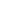

# Mergify Logo

This repository contains source files for Mergify logo.

## Usage

You can build PNG versions from the master SVG files. Simply type `make`.

### mergify-{black,white}

The primary Mergify logo. It is the central part of the visual identity. It’s a
pure monochrome – black and white – logo.

This is the primary Mergify logo for use on black or dark achromatic
backgrounds.

### mergify-brandmark-{white,black}

The brand mark of Mergify can be used separately. As a digital-first company
where brand recognition is important in various situations where space is
limited, this brand mark can be used. We distinguish a primary version for
regular use: such as the mergiy logo within navigation of the platform, or for
usage on social media profile images and more subtle marks in imagery or social
media covers.

### mergify-brandmark-{white,black}-secondary

The secondary version is used for very small sizes (such as a browser favicon
at 40px or smaller).

### mergify-brandmark-multi-bg{,-secondary}

This version of the brand mark makes it possible to be used for both light and
dark background. This is especially useful if you don't control the background
that will be used to display the brand mark.

## Guidelines

### Please do

- Use the Mergify logo to link to Mergify
- Use the Mergify logo to advertise that your product is built using Mergify
- Use the Mergify logo in a blog post or news article about Mergify

### Please don't

- Create a modified version of the Mergify logo
- Use or sell any Mergify artwork without permission
- Change the colors, dimensions, add your own text/images or create a modified
  version of the logo

## License

Mergify and the Mergify logo design are exclusive trademarks registered by
Mergify SAS.

All rights reserved.

No adaptation or use of any kind of any of our registered trademarks or
copyrights, or any other contents of this website, is allowed without the
express written permission of Mergify SAS.

For more information regarding the authorized uses of these items please
contact us.
